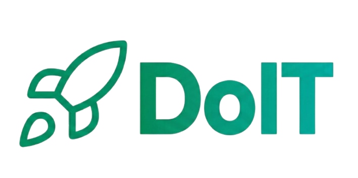
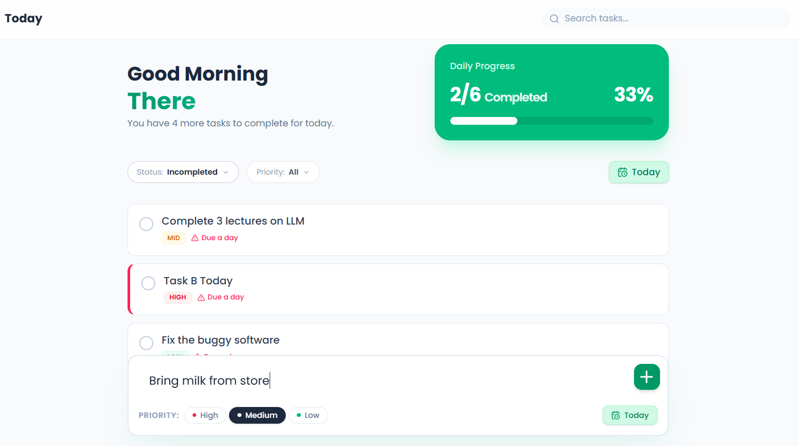

  
  
  

    <b>DoIT is a today & tomorrow focused, calm, minimal, and minimalistic todo app. It is build for the people who want to work calmly and consistently, focus mainly on today and tomorrow.</b>
  

### ✨ What ProblemDoes It Solve?

- **Today & Tomorrow Focus:** Most of the TODO apps are just a list of tasks, task scheduling, remider and all. This app's main aim is to focus on today and tomorrow.
- **Clarity over guilt:** User always know what matters *today*.
- **Calm consistency:** Built for people who want to work calmly and consistently, not hustle endlessly.

  

## 🚀 Core Features

### 🗓 Today-First Task Management

- See only what’s relevant for **today**.
- Tomorrow and Overdue tasks are clearly separated.
- No anxiety-inducing huge list of everything you've ever thought of doing.

### 🔄 Efficient Rescheduling

- Move tasks to the next day with **one click**.
- **Bulk reschedule** unfinished tasks at the end of the day.
- Track how often a task is postponed (without shaming, just for awareness).

### ⚠️ Gentle Overdue Handling

- Missed tasks are clearly visible in an **Overdue view**.
- They don't disappear, don't clutter your minimal "Today" list.
- Encourages recovery and planning, not guilt.

### 📊 Daily Progress & Focus

- Simple **progress indicator** in the header.
- **Priority-Driven Focus:** High-priority tasks are visually highlighted (3 levels).
- Minimal, clean, and accessible UI.

## 🛠️ Technologies Used

### Frontend

- **React (Vite)**
- **Tailwind CSS**
- **Lucide Icons** for beautiful icons

### Backend & Auth

- **Supabase** (PostgreSQL database)
- **Supabase Auth** (Secure login, registration, user isolation)

## 📦 Deployment

- **Frontend:** Deployed on Vercel
- **Backend:** Hosted on Supabase

## 📌 Project Status

**Current Version:** 1.0 (V1) — **Complete** ✅

The app is stable and usable with all core features implemented.

**Future Roadmap:**

- [ ] Notes support
- [ ] History tracking for tasks
- [ ] Retention improvements

## Authors

- [@Mr-Atanu-Roy](https://github.com/Mr-Atanu-Roy)

